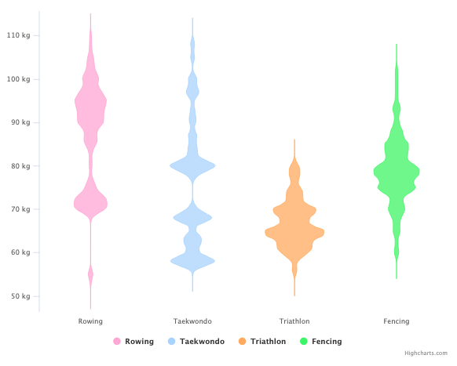

# violin-plot
This function (`processViolin()`) allows you to create a violin chart using [Highcharts](https://www.highcharts.com/): 

*Check [codePen demo](https://codepen.io/mushigh/pen/eYJXjVe)*




You can either add the function direclty in your code (see [violin-plot.js](violin-plot.js)) or use the following [link](https://marketing-demo.s3-eu-west-1.amazonaws.com/violinFunction/processViolin.js) (see below):
````
<script src="https://marketing-demo.s3-eu-west-1.amazonaws.com/violinFunction/processViolin.js"></script>
````


Here is the description of the function’s parameters:
* **step** is the minimum data set unit. The step is used to sample the data set and create the KDE.
* **precision** is used to refine the violin plot at the extremities and in the thin spots, the smallest this parameter is the more points you get on the extremities and the thin spots on the chart.
* **densityWidth** is used to widen the violin. This parameter should be equal to 1 to reflect the result of the KDE values. Nevertheless, for visibility purposes, you are free to change the densityWidth to get a wider and visible shape. 
* **arg**s is one or many arrays that represent the data set. In our case, args is four arrays of weight athletes, one array for each discipline.

## Example

```
let arr1 = [1,2,2,2,5,8,9,9], arr2=[3,4,5], arr3=[1,2,2,3];
let step = 1,
    precision = 0.00000000001,
    width = 3;
let data = processViolin(step,precision,width,arr1, arr2,arr3);
```

## Remark
The function is built around the [kernel density estimation (KDE)](https://www.highcharts.com/blog/tutorials/data-science-and-highcharts-kernel-density-estimation/).
